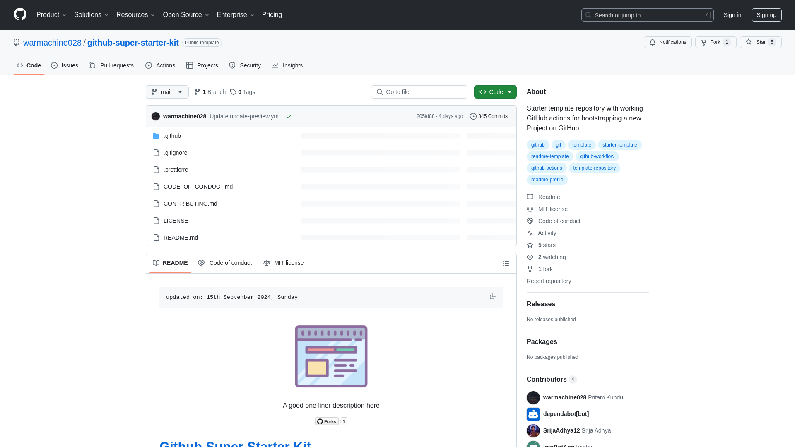

    updated on: 19th September 2024, Thursday

<div align=center>
    <a href="https://session-server.onrender.com">
        
    </a>
    <p style="font-family: roboto, calibri; font-size:12pt; font-style:italic"> A server to authenticate users with sessions and cookies </p>
    <a src="https://github.com/warmachine028/session-server/forks">
        
    </a>
</div>

# [Session Server](https://session-server.onrender.com)

![line]

## Table of Contents

- [Introduction](#introduction)
- [Getting Started](#getting-started)
- [Development](#development)
- [Tech Stack Used](#tech-stack-used)
- [Preview](#preview)
- [Best Contributors](#best-contributors)
- [License](#license)

![line]

## Introduction

- Built with node.js, this is a server hosted on [render.com] to authenticate users.

## Getting Started

- Navigate to [home](https://session-server.onrender.com/home), an error message is found stating `{ "error": "unauthorized" }`.
- Navigate to [login](https://session-server.onrender.com/login) to authenticate yourself.
- You will be able to access the home route after that, where you can see the `logout` button and a cookie in you `Application > Storage > Cookies` tab in browser.

## Development

```sh
$> cd server
$> bun i
$> bun run dev
```

![line]

## Tech Stack Used

- Bun
- Node.JS
- Express.JS
- Express-session
- Cookies
- Render
- EJS
- Nodemon


           

![line]

## Preview

<picture align="center">
    <source media="(prefers-color-scheme: light)" srcset=".github/preview-light.png">
    <source media="(prefers-color-scheme: dark)" srcset=".github/preview-dark.png">
    
</picture>

![line]

## Best Contributors

<div align="center">
    <a href="https://github.com/warmachine028/session-server/graphs/contributors">
        
    </a>
</div>

![line]

## License

- See [LICENSE]

**Pritam Kundu, 2024**

![line]

## Thank you, everyone 💚

[icons]: https://icons8.com/
[markdown-badges]: https://github.com/Ileriayo/markdown-badges
[custom-icons]: https://simpleicons.org/
[line]: https://user-images.githubusercontent.com/75939390/137615281-3a875960-92cc-407f-97fe-fd2319bdb252.png
[License]: https://github.com/warmachine028/session-server/blob/main/LICENSE
[render.com]: (https://render.com)
<!-- 19/09/24 -->
